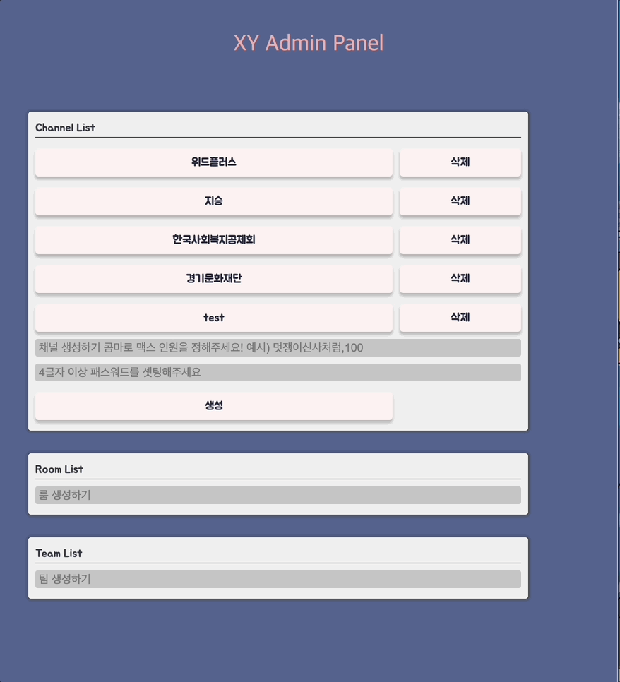

# XY Game


## Quick Start

```
<!-- 클라이언트 환경입니다. 반드시 localhost:3000에서 실행해야 CORS 이슈를 만나지 않습니다. -->
git clone https://github.com/X-y-game/x-y-game.git
cd x-y-game
npm install
npm start 

 <!-- 서버 환경입니다. -->
git clone https://github.com/X-y-game/X-y-game-server.git
cd x-y-game-server
npm install
npm run dev 

<!-- // 서버 환경 루트 디렉토리에 .env파일을 생성하고 다음과 같이 설정합니다.
PORT = <default Port 8080 or SET_YOUR_PORT>
COOKIE_SECRET=<SET_YOUR_COOKIE_SECRET>
DB_URL=<YOUR_MONGODB_ATLAS_URL>
 -->
```

게임 사용자 페이지 : http://localhost:3000/    
게임 매니저(진행자) 페이지 : http://localhost:3000/manager    
게임 관리자(어드민) 페이지 : http://localhost:3000/admin    

## **🚪** Overview

- [죄수의 딜레마](https://en.wikipedia.org/wiki/Prisoner's_dilemma) 개념을 활용한 XY 게임을 웹 콘텐츠로 개발했습니다. 4팀이 10라운드를 거쳐 최대 이익을 달성하는 멀티 플레이어 게임이며 기업 교육(한국사회복지공제회, 경기문화재단 등)용으로 서비스중입니다.

- 해당 웹 어플리케이션은 모바일 환경에 최적화되어 있습니다.

## **Usage**

1. 관리자 페이지에서 채널, 룸 및 팀을 생성합니다.
2. 교육생(유저)은 관리자가 알려준 비밀번호로 채널, 룸, 팀으로 이동합니다.
3. 게임의 규칙은 아래와 같습니다.
   - 모두가 X를 선택 : 각 -100 손실
   - 모두가 Y를 선택 : 각 100 이익
   - X가 두 팀, Y가 두 팀 : X 200 이익, Y 200 손실
   - X가 세 팀, Y가 한팀 : X 100 이익, Y 300 손실
   - X가 한팀, Y가 세팀 : X 300 이익, Y 100 손실
   - 5라운드 가중치 3배, 8라운드 가중치 5배, 10라운드 가중치 10배가 적용됩니다.
4. 4팀은 X, Y중 하나의 카드를 선택하여 제출 합니다.
5. 교육자(매니저)는 4팀의 제출이 확인되면 라운드 결과를 보여주고 다음 라운드를 진행합니다.
6. 10라운드가 되면 게임이 종료되고, 최종 결과를 확인합니다.

## **Tech Stack**

|                      Frontend                       |                         Backend                          |                etc                 |
| :-------------------------------------------------: | :------------------------------------------------------: | :--------------------------------: |
| ES2015+<br>React<br>Styled-Component<br>react-table | MongoDB<br>Mongoose<br>Express<br>Node.js<br>Mongo Atlas | Jest<br>ESLint<br>Husky<br>Netlify |

## **Feature**

### Admin 페이지
- 관리자가 채널, 팀, 룸을 생성 및 삭제합니다.   


### 게임 입장
- 유저는 채널, 룸, 팀을 선택해 게임에 입장합니다.   


### 인게임
좌 : 유저 화면, 우 : 매니저 화면

- 팀 선택 시 참여 상태가 전달되며 매니저는 팀 접속에 따라 게임을 시작할 수 있습니다.    


- 게임이 시작되면 유저들은 게임 페이지로 이동됩니다.    


- 각 팀은 카드를 제출/재제출할 수 있으며 같은 팀에 접속한 유저들끼리 동기화됩니다.    


- 4팀의 카드 선택이 완료되면 매니저는 라운드 결과를 보여줄 수 있습니다.    


- 매니저는 4팀의 카드 선택이 완료 되어야 라운드 결과를 보여줄 수 있고, 라운드 결과를 보여준 뒤 다음 라운드를 진행할 수 있습니다.    


- 10라운드가 끝나면 최종 결과를 확인할 수 있습니다.    


