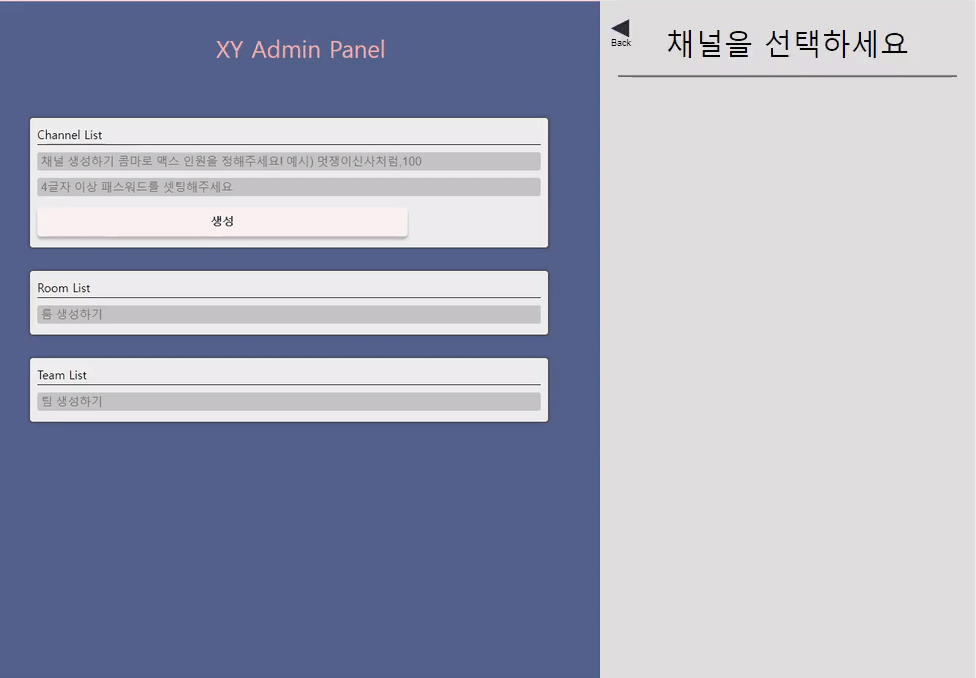
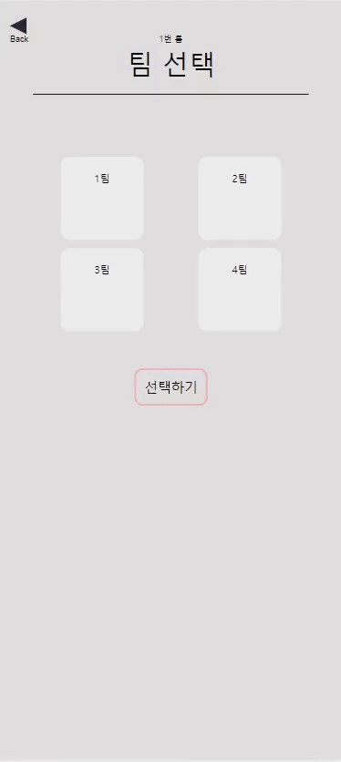
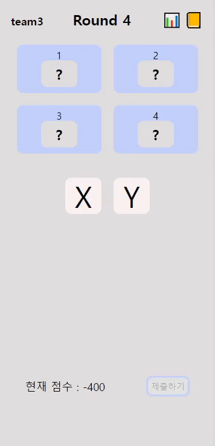
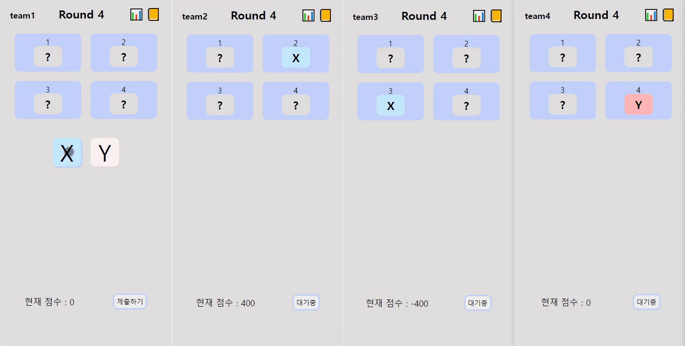
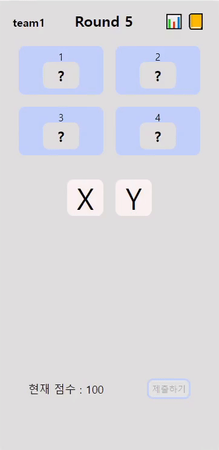
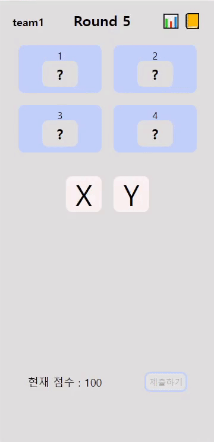
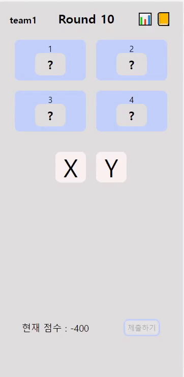
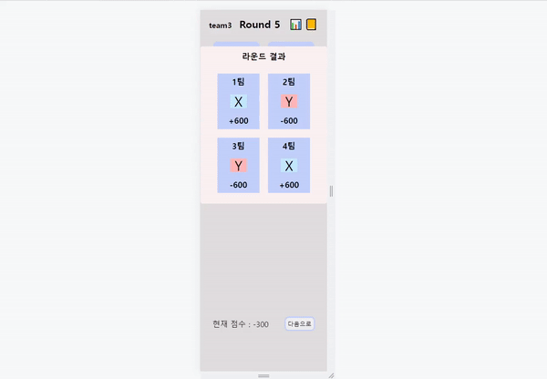
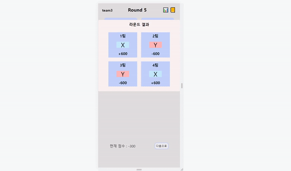
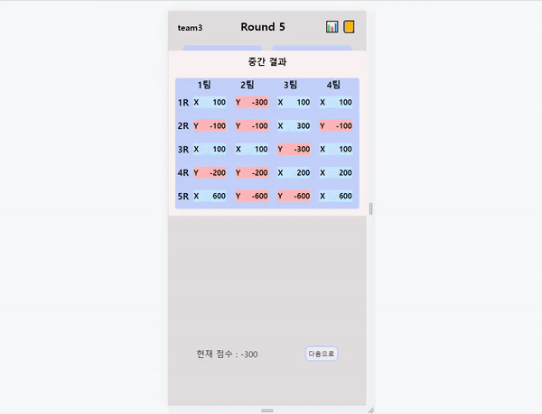

# XY Game

## **🚪** Overview

[죄수의 딜레마](https://en.wikipedia.org/wiki/Prisoner's_dilemma) 개념을 활용한 XY 게임을 웹 콘텐츠로 개발

4팀이 10라운드를 거쳐 최대 이익을 달성하는 멀티 플레이어 게임

위드플러스에서 기업 교육에서 런칭 예정

## **💡 Motivation**

- 교육용 오프라인 게임을 웹 앱을 서비스함으로써 게임을 통한 **교육의 효율성**을 제공하고 싶었습니다.
- 다양한 사용자에게 서비스를 제공하고 그에 따른 피드백을 실질적으로 반영하는 과정을 겪고자 기업 교육에 사용되는 웹 앱을 개발하여 런칭하였습니다.

## \***\*🔗 Repository\*\***

- **Client**: [https://github.com/X-y-game/x-y-game](https://github.com/X-y-game/x-y-game)
- **Server**: [https://github.com/X-y-game/X-y-game-server](https://github.com/X-y-game/X-y-game-server)

## **Requirement**

- 해당 웹 어플리케이션은 모바일 환경에 최적화되어 있습니다.
- X-y-game-server에서 .env 파일을 설정해주어야 합니다.

## **Get Started**

### CLIENT

`git clone https://github.com/X-y-game/x-y-game.git cd X-y-game npm install (or yarn) npm start (or yarn)`

### SERVER

`git clone https://github.com/X-y-game/x-y-game-server.git cd X-y-game npm install (or yarn) npm run dev`

- MongoDB 계정이 필요하며 Root 디렉토리에 .env 파일을 만들고 다음과 같이 설정합니다.

`DB_URL = <YOUR_MONGODB_ATLAS_URL> PORT = <default Port 8080 or SET_YOUR_PORT>`

`COOKIE_SCRET = <SET_YOUR_COOKIET_SECRET>`

`git clone https://github.com/X-y-game/X-y-game-server.git`

`cd X-y-game-server`

`npm install (or yarn)`

`npm start (or yarn)`

## Release Note

V1.0.0 First Release

## **Usage**

1. 관리자 페이지에서 채널 , 룸 및 팀을 생성합니다.
2. 교육생(유저)은 관리자가 알려준 비밀번호와 함께 채널, 룸, 팀으로 이동합니다.
3. 게임의 규칙은 아래와 같습니다.
   - 모두가 X를 선택 : 각 -100 손실
   - 모두가 Y를 선택 : 각 100 이익
   - X가 두 팀, Y가 두 팀 : X 200 이익, Y 200 손실
   - X가 세 팀, Y가 한팀 : X 100 이익, Y 300 손실
   - X가 한팀, Y가 세팀 : X 300 이익, Y 100 손실
   - 5라운드 가중치 3배, 8라운드 가중치 5배, 10라운드 가중치 10배가 적용됩니다.
4. 4팀은 X, Y중 하나의 카드를 선택하여 제출 합니다.
5. 4팀이 모두 카드를 제출하면 해당 라운드의 선택 결과와 손익 정보가 표시됩니다.
6. 10라운드가 되면 게임이 종료되고, 최종 결과를 확인합니다.

## **Tech Stack**

|                      Frontend                       |                         Backend                          |                etc                 |
| :-------------------------------------------------: | :------------------------------------------------------: | :--------------------------------: |
| ES2015+ React Styled-Component react-table | MongoDB Mongoose Express Node.js Mongo Atlas | Jest esLint Husky Netlify |

## Feature

- Admin 페이지를 통해 관리자가 채널, 팀 , 룸 생성 및 삭제

- 비밀번호를 통한 인증으로 채널에 접속할 수 있도록 함
  
- 4팀 인원 수를 기다리는 로딩
  
- X, Y카드 중 하나를 선택하여 제출
  
- 4팀 모두 선택 되면 라운드 결과 모달이 표시
  
- 상단 버튼을 통해 현재까지의 결과를 확인할 수 있음
  
- 상단 버튼을 통해 게임의 규칙을 확인할 수 있음
  
- 10라운드 종료 후 최종 결과 모듈 표시
  
- 최종 결과 모듈에서 필터를 통해 정보 확인 가능
  
- 반응형 처리
  
  
  

## Things to do

- 게임이 10라운드까지 진행된 후 같은 채널과 팀으로 들어오면 url 채널 11라운드로 되는 문제
- 한번 게임을 10라운드까지 진행 후 , 원래 만들어진 채널과 팀으로 오면 로딩 없이 바로 게임이 시작되는 부분 수정 필요
- 협상 과정 추가

## Remind

### Socket.io

- 한 게임룸당 4팀이 들어와야 하며, 4팀이 전부 준비상태가 되면 게임 시작 버튼을 활성화 해주려고 했습니다. 서버 socket 쪽에서 각 팀이 준비버튼을 누른 지 확인하여, emit를 해주었지만 마지막에 접속한 브라우저는 렌더링이 되지 않는 문제가 있었습니다.
- 이를 해결하기 위해 먼저 socket이 작동하는 원리에 대해 제대로 이해를 해야 했고, 문서를 반복해서 읽어야 했습니다. 그 룸 전체 소켓 그룹에 대해 상황을 알려주어야 그 상태를 받고 렌더링을 되는 것을 파악하였고, 로직을 수정하였습니다.

### Mongo DB

- 이전 교육용 프로그램에서는 데이터 보안 처리가 안되어 있어 데이터베이스 관리를 통해 ip 접근 및 액세스를 제한하고 싶었습니다. 막상 제작해보니, 교육용으로 염두해두고 제작해두었기 때문에 데이터가 방대하지 않으므로 , 외부 데이터베이스가 아닌 json파일로 관리 했어도 괜찮았을 것 같습니다.

### React

- 이번 프로젝트에서 TDD 방식을 해보기 위해 , \***\*Container-Presenter 패턴\*\*** 을 사용 해서 (Presentation)과 비지니스 로직 컴포넌트(Container)를 구분해서 작업했습니다. 테스트 코드를 작성하면서 단위별, 컴포넌트별 테스트를 작성하다 보니 이렇게 나눈 이점이 체감되었습니다.
- eslint에 의한 propType 유효성 검사 오류가 있었는데, object로 명시하는 경우에는 array로, array로 명시하는 경우에는 object로 fix를 제안하는 오류가 발생했고, 유효성 검사에 대한 문서나 비슷한 문제를 검색하여 얻은 정보를 통해 oneofType을 사용해서 유효성 오류를 해결했습니다.
- eslint와 컨벤션의 사용, 일관성있는 propTypes를 지정하면서, 팀원들이 한 코드에 대해 디버깅을 할 경우, 어떤 props가 넘어오는지 쉽게 파악이 가능하였고, 로직을 읽는데도 많은 도움이 되었습니다.
